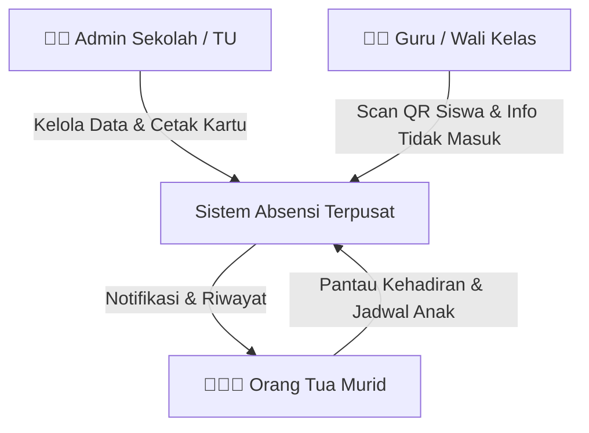
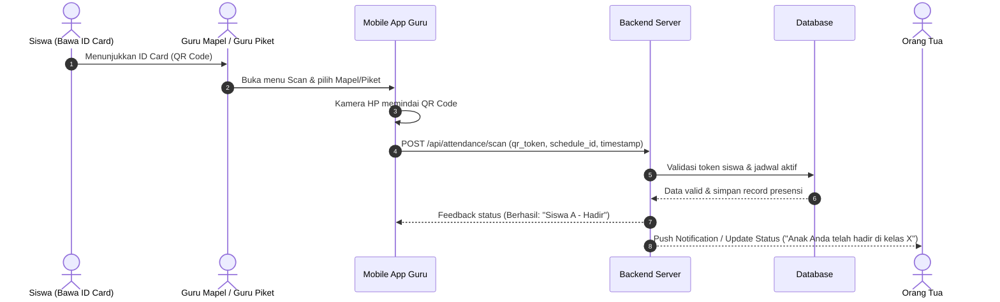
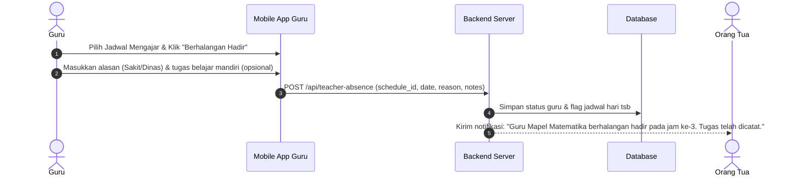
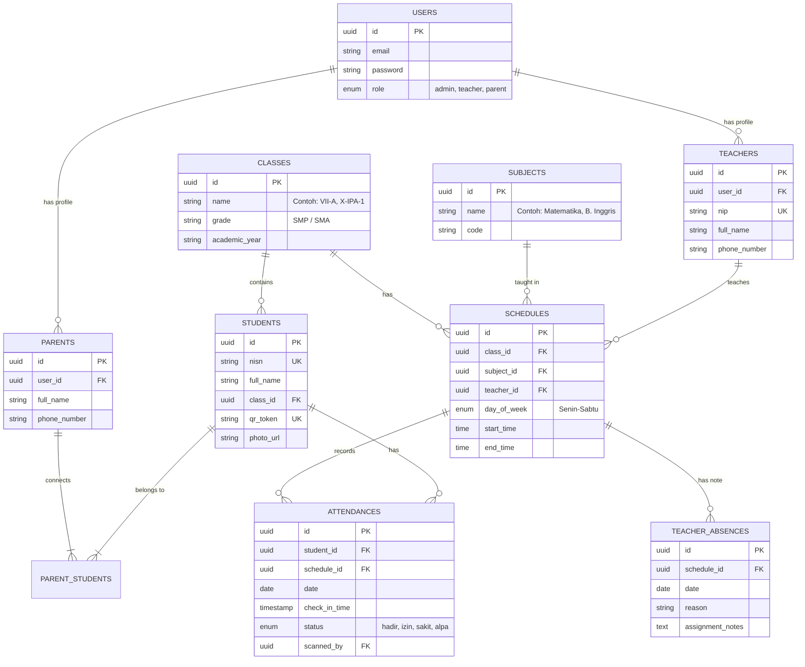
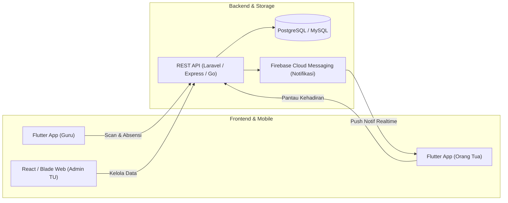

# Blueprint Sistem Absensi & Monitoring Siswa Berbasis QR Code ID Card (SMP & SMA)

## 1. Pendahuluan & Latar Belakang
Sistem ini dirancang untuk mendigitalkan proses pencatatan kehadiran siswa di tingkat SMP dan SMA, sekaligus memberikan transparansi penuh kepada orang tua murid secara real-time. Dengan memanfaatkan kamera smartphone guru/petugas untuk memindai kartu pelajar (ID Card) ber-QR code, sekolah dapat menghemat biaya pengadaan alat pemindai fisik (*barcode scanner hardware*) tanpa mengurangi efisiensi dan akurasi absensi.

---

## 2. Aktor & Peran Pengguna (User Roles)

| Peran | Tanggung Jawab Utama | Platform Akses |
| :--- | :--- | :--- |
| **Admin Sekolah / Tata Usaha (TU)** | • Mengelola data master siswa, kelas, guru, dan mata pelajaran. • Mengatur jadwal pelajaran mingguan (Senin–Jumat/Sabtu). • Menghasilkan (generate) data QR Code dan mencetak ID Card siswa. • Monitoring laporan kehadiran sekolah secara menyeluruh. | Web Dashboard |
| **Guru / Pengajar** | • Login ke aplikasi mobile. • Melakukan *scanning* QR code ID Card siswa menggunakan kamera HP pada jam mata pelajaran atau jam piket gerbang. • Melihat jadwal mengajar mingguan. • Mengisi dispensasi/status kehadiran (Hadir, Sakit, Izin, Alpa). • Mengirimkan notifikasi izin/berhalangan hadir jika guru tidak dapat mengajar ke sistem/orang tua. | Mobile App (Android/iOS) |
| **Orang Tua Murid** | • Login ke aplikasi mobile menggunakan kredensial khusus yang terhubung dengan akun siswa. • Melihat status absensi harian anak (apakah sudah sampai di sekolah atau belum). • Melihat absensi per mata pelajaran anak secara real-time. • Memantau jadwal mata pelajaran mingguan anak. • Menerima notifikasi jika ada guru mata pelajaran yang berhalangan hadir. | Mobile App (Android/iOS) |

---

## 3. Alur Proses Bisnis Utama (Core Workflows)

### 3.1. Alur Absensi Siswa via Scan QR Code

### 3.2. Alur Pelaporan Guru Berhalangan Hadir

---

## 4. Desain Struktur Data & Database (ERD)

---

## 5. Fitur Rinci per Modul

### A. Modul Master & Kartu Siswa (Web Admin)
1. **Manajemen Pengguna & Rombel**: CRUD Siswa, Kelas, Guru, Jadwal Pelajaran (Senin s.d. Jumat/Sabtu).
2. **Generator Kartu Pelajar (ID Card Generator)**:
   - Membuat kartu siap cetak (ukuran standar ID Card CR80).
   - Menanamkan QR Code berisi hash unik (`qr_token`), bukan plain text NISN, untuk keamanan data.
   - Ekspor template ID Card ke format PDF untuk dicetak massal.

### B. Modul Guru (Mobile App)
1. **Scanner QR Kamera Bawaan HP**:
   - Deteksi cepat (*fast continuous scan*) tanpa perlu menekan tombol ulang setiap ganti siswa.
   - Umpan balik suara/getar jika siswa berhasil ter-scan.
2. **Presensi Manual & Rekap Kelas**:
   - Tombol pengganti manual jika kartu siswa tertinggal/hilang (pilih Sakit, Izin, atau Alpa).
3. **Pemberitahuan Guru Berhalangan Hadir**:
   - Form izin guru untuk jam mengajar tertentu, dilengkapi pesan/tugas pengganti yang diteruskan ke orang tua dan wali kelas.

### C. Modul Orang Tua (Mobile App)
1. **Dashboard Monitoring Real-time**:
   - Indikator status anak hari ini: *Belum Hadir*, *Di Sekolah*, *Sedang Mengikuti Mapel [X]*, atau *Izin/Sakit*.
2. **Jadwal Pelajaran Lengkap**:
   - Kalender/daftar mata pelajaran Senin s.d. Jumat/Sabtu.
   - Status kehadiran di tiap slot jam pelajaran (misal: Jam 1 Matematika - Hadir, Jam 2 Bahasa Indonesia - Hadir).
3. **Pusat Notifikasi**:
   - Riwayat notifikasi masuk sekolah.
   - Informasi resmi jika guru mata pelajaran berhalangan hadir.

---

## 6. Rekomendasi Arsitektur Teknologi

- **Mobile Client**: **Flutter** (Dart) – Dapat dibuat 1 aplikasi dengan multi-role login, atau 2 aplikasi terpisah. Mendukung pemindaian kamera cepat dengan library `mobile_scanner`.
- **Backend API**: **Laravel (PHP)** atau **Node.js (NestJS / Express)** – Laravel sangat cepat untuk integrasi Web Admin (menggunakan FilamentPHP) dan menyediakan API authentication (Sanctum/JWT).
- **Database**: **PostgreSQL** atau **MySQL** – Relasional, stabil untuk relasi data jadwal dan presensi.
- **Push Notification**: **Firebase Cloud Messaging (FCM)** – Gratis, efisien untuk notifikasi instan ke HP orang tua.
